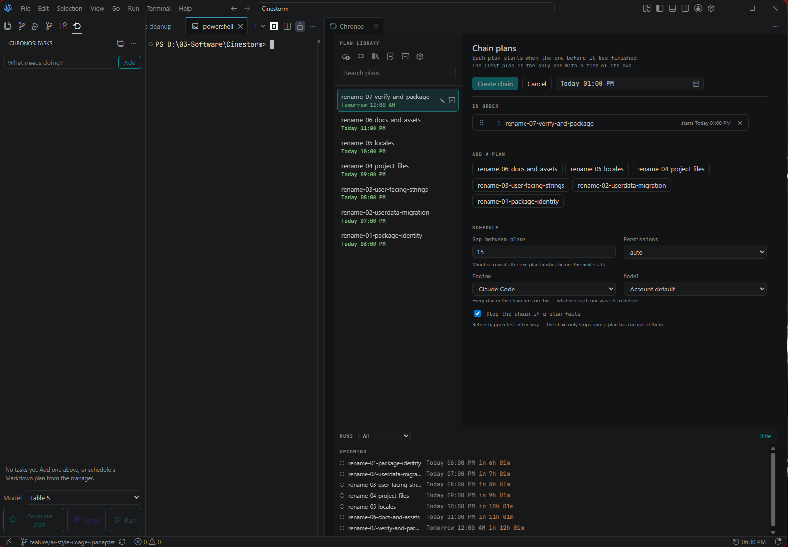
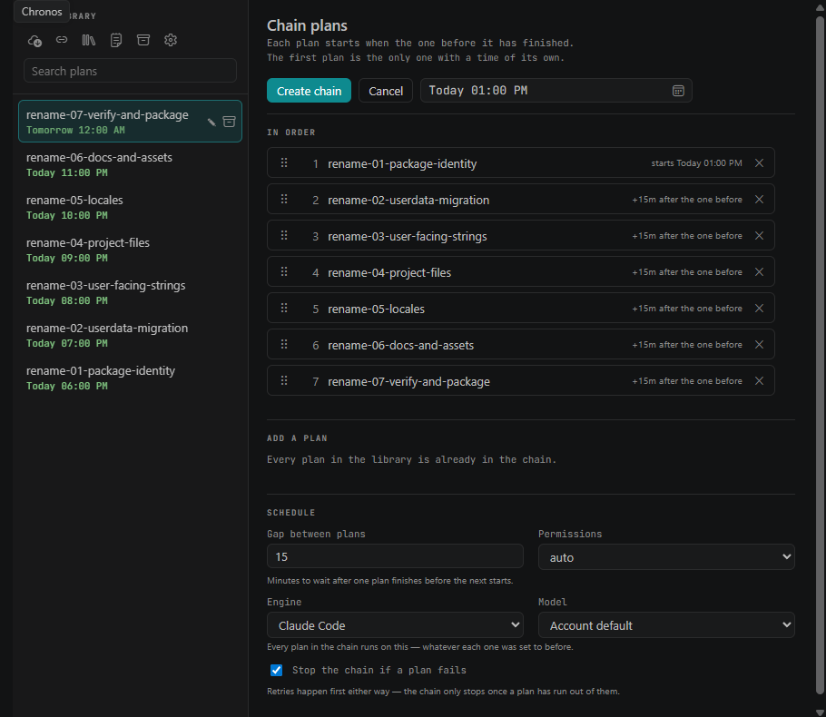
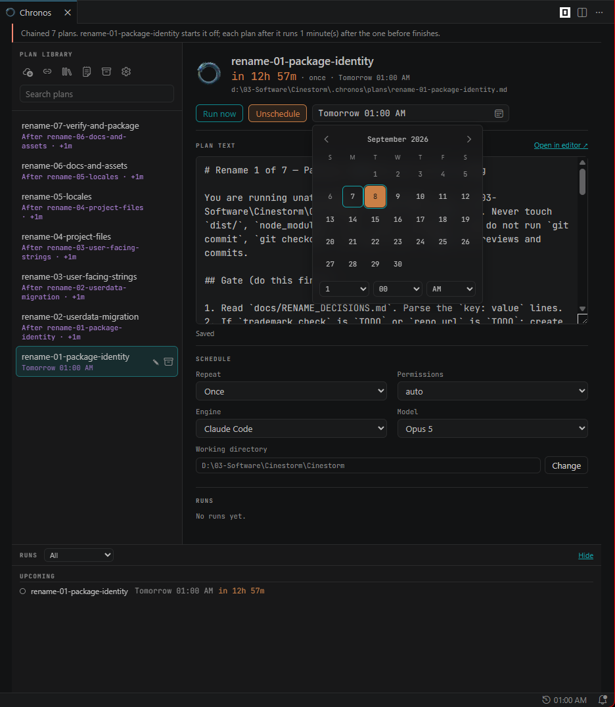

# Synchrony

A precise scheduling system for coding-agent tasks, integrated within VS Code.

Synchrony translates Markdown plans into automated, scheduled executions. It unifies task capture, planning, and execution into a single, coherent workflow. One system. No fragmentation.



## The Manager Interface

A unified view for total control. The plan library resides on the left; execution details—schedule, working directory, permissions, and run history—on the right. 

Access is immediate: via the activity bar, the status bar, or the command palette (`Synchrony: Open Manager`).

**Integration**
Plans are added via creation, context menu, drag-and-drop, or import. The source file is copied into the library and scheduled. The original remains untouched, preserving user intent and preventing unintended modifications.

## Task Capture

Ideas precede structure. The Tasks view serves as a transient inbox for unformed concepts, bridging the gap between a fleeting thought and a formal plan.

Capture requires a single action: type and enter. From here, a task can be explained, expanded into a formal plan, edited, or discarded.

*   **Generation:** Initiating a plan opens an interactive terminal session. The agent clarifies requirements before committing to an approach. Upon approval, the plan is written to the library, the task is resolved, and the manager prepares the schedule.
*   **Explanation:** The explain function analyzes the task and project context, providing a plain-language assessment of the required change and its alternatives, without altering the codebase.



## Project Isolation

State is strictly localized. Each project maintains its own `.synchrony` directory, containing plans, tasks, archives, results, and logs. 

This ensures that opening a project reveals only its relevant work. Schedules execute only when the project window is active, preventing unintended cross-project interference.

## The Plan Library

The file system is the database. Plans reside as `.md` files in `.synchrony/plans`. This eliminates synchronization errors and allows seamless external editing.

**Lifecycle**
*   Completed one-shot plans are automatically archived.
*   Failed or cancelled plans remain visible for correction.
*   Recurring plans persist indefinitely.
*   Deleting a plan file removes its schedule instantly.

## Execution and Documentation

Plans are piped directly to the selected coding-agent CLI via standard input. Synchrony currently supports Claude Code, opencode, and Codex. This eliminates argument length limits, shell escaping issues, and pathing errors.

**Transcripts**
Every execution generates a permanent Markdown record in `.synchrony/results`. This document details the execution conditions, tool calls, agent narration, and final outcome (cost, duration, status). It is the definitive, auditable record of the system's action.



## Agent Integration (MCP)

Synchrony exposes its functionality via the Model Context Protocol. External agents can capture tasks, author plans, and manage schedules.

Communication occurs strictly over standard input/output. No network ports or tokens are required, ensuring absolute local containment.

**Remote Resolution**
Planning sessions can be paused and resolved remotely via MCP tools (`list_questions`, `answer_question`). This maintains workflow continuity without requiring local terminal presence, while strictly limiting the agent's permissions to prevent unauthorized scheduling.

## Operational Integrity

Unattended execution requires strict boundaries. Good design is honest about its limitations and risks.

1.  **Permissions:** Tasks default to `auto`. Elevated permissions (`bypassPermissions`) require explicit, manual approval to prevent unrestricted autonomous action.
2.  **Resource Awareness:** Executions incur computational costs. The interface displays a rolling 7-day total to maintain constant visibility.
3.  **Graceful Degradation:** Missed executions are not forced. They are marked and await user decision. Failed runs retry logically; a plan in a chain that fails for a temporary reason keeps retrying every hour on the hour, so one outage does not take the rest of the chain down with it; unrecoverable errors halt immediately. Daylight Saving Time transitions are handled via local wall-clock rules, preventing temporal drift.

## Configuration

Parameters are explicit and minimal.

| Setting | Default | Function |
| :--- | :--- | :--- |
| `synchrony.claudePath` | `claude` | Path to the Claude Code executable. |
| `synchrony.opencodePath` | `opencode` | Path to the opencode executable. |
| `synchrony.codexPath` | `codex` | Path to the Codex executable. |
| `synchrony.libraryPath` | `.synchrony/plans` | Directory for plan files. |
| `synchrony.resultsPath` | `.synchrony/results` | Directory for run transcripts. |
| `synchrony.maxConcurrent` | `1` | Parallel agents in one repository. |
| `synchrony.maxRetries` | `3` | Attempts after a failure. |
| `synchrony.retryDelayMinutes` | `60` | Delay before retrying. |
| `synchrony.graceWindowMinutes` | `15` | Tolerance for late execution. |
| `synchrony.idleTimeoutMinutes` | `15` | Termination threshold for inactive runs. |
| `synchrony.maxRuntimeMinutes` | `60` | Hard ceiling on execution time. |
| `synchrony.logRetentionDays` | `30` | Transcript retention period. |

## Development

The architecture is modular. Core logic (`outcome.ts`, `recurrence.ts`) is decoupled from the VS Code host, enabling pure-logic testing in a standard Node environment.

```bash
npm install
npm run watch      # Continuous build
npm run typecheck  # Static analysis
npm test           # Unit tests
npm run package    # Build and package extension
npm run clean      # Remove build output and old .vsix packages
```

Press <kbd>F5</kbd> to launch the Extension Development Host.

## MIT license
Use freely.

2026 Z3n Agentic Systems.
